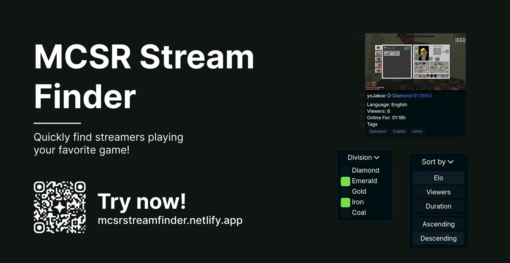

# MCSR Stream Finder

This free & open-source web app helps you find and filter for streamers that are currently playing MCSR.

## How does this work?

With the help of [MCSR's API](https://docs.mcsrranked.com/#live-), I pull a list of all players who are currently streaming MCSR, have linked their Twitch account and have the "Public Stream" option enabled. Using Twitch's API, I pull some information about the streamer!
The backend is free and open-source too, you can find it in the [mcsr-stream-finder-backend](https://github.com/kolpixx/mcsr-Stream-Finder-backend) respository. Feel free to check check it out or host an instance yourself!

## Images

### Banner

## License

This project is licensed under [MIT](./LICENSE).